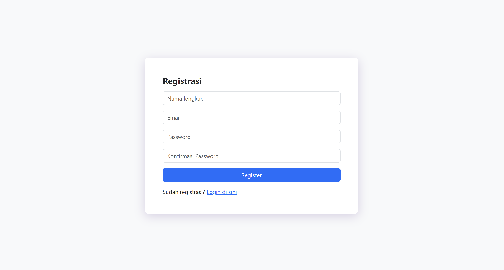

# 🔐 Login & Register System

Sistem autentikasi berbasis PHP dengan tampilan modern, mendukung **Light/Dark Mode**, validasi form, dan keamanan dasar menggunakan hash password.

---

## 📸 Preview

| Halaman Login | Halaman Registrasi |
|:---:|:---:|
|  |  |

---

## ✨ Fitur

- ✅ Registrasi pengguna baru dengan validasi form
- ✅ Login dengan pengecekan kredensial ke database
- ✅ Password di-hash menggunakan `password_hash()` (bcrypt)
- ✅ Tampilan modern dengan Light & Dark Mode
- ✅ Password visibility toggle
- ✅ Password strength indicator
- ✅ Session management & logout
- ✅ Responsive design

---

## 🛠️ Teknologi

- **PHP** — Backend & logika autentikasi
- **MySQL** — Database (via XAMPP)
- **HTML5 + CSS3** — Tampilan antarmuka
- **Bootstrap** — Layout responsif

---

## ⚙️ Cara Instalasi

### Prasyarat
- [XAMPP](https://www.apachefriends.org/) sudah terinstall
- PHP >= 7.4
- MySQL

### Langkah-langkah

1. **Clone repository ini:**
   ```bash
   git clone https://github.com/USERNAME/NAMA-REPO.git
   ```

2. **Pindahkan folder ke direktori XAMPP:**
   ```
   C:\xampp\htdocs\login-register2\
   ```

3. **Setup database:**
   - Buka **phpMyAdmin** di `http://localhost/phpmyadmin`
   - Buat database baru bernama `login-register`
   - Import file SQL jika tersedia, atau buat tabel secara manual:

   ```sql
   CREATE DATABASE `login-register`;
   USE `login-register`;

   CREATE TABLE `users` (
     `id` INT AUTO_INCREMENT PRIMARY KEY,
     `username` VARCHAR(100) NOT NULL,
     `email` VARCHAR(150) NOT NULL UNIQUE,
     `password` VARCHAR(255) NOT NULL,
     `created_at` TIMESTAMP DEFAULT CURRENT_TIMESTAMP
   );
   ```

4. **Konfigurasi database:**
   - Salin file `database.example.php` menjadi `database.php`:
     ```bash
     cp database.example.php database.php
     ```
   - Edit `database.php` sesuai konfigurasi lokal kamu:
     ```php
     $hostName   = "localhost";
     $dbUser     = "root";
     $dbPassword = "";          // Isi password MySQL kamu jika ada
     $dbName     = "login-register";
     ```

5. **Jalankan aplikasi:**
   - Pastikan **Apache** dan **MySQL** aktif di XAMPP Control Panel
   - Buka browser dan akses: `http://localhost/login-register2/`

---

## 📁 Struktur File

```
login-register2/
├── index.php               # Halaman utama (dashboard setelah login)
├── login.php               # Halaman login
├── registrasi.php          # Halaman registrasi
├── logout.php              # Proses logout & hapus session
├── database.php            # Konfigurasi koneksi database (tidak di-push)
├── database.example.php    # Template konfigurasi database
├── style.css               # Styling tambahan
└── README.md               # Dokumentasi proyek
```

---

## 🔒 Keamanan

- Password di-hash menggunakan `password_hash()` dengan algoritma **bcrypt**
- Verifikasi login menggunakan `password_verify()`
- File `database.php` **tidak di-push** ke repository (ada di `.gitignore`)

---

## 👤 Author

**Muhammad Habibie R**  
Telkom University — Keamanan Sistem, 2026

---

## 📄 Lisensi

Project ini dibuat untuk keperluan tugas akademik.
