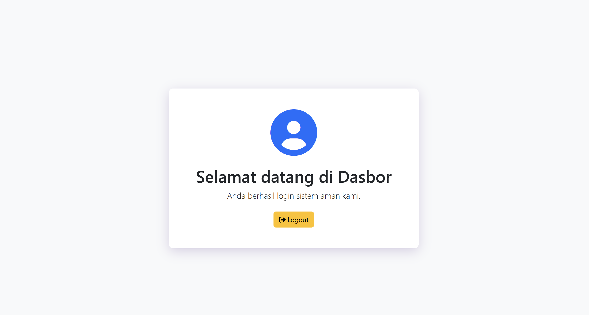

# 🔐 ArgonAuth — Sistem Login & Registrasi

Sistem autentikasi berbasis **PHP & MySQL** dengan nama **ArgonAuth**, menggunakan algoritma hash password **Argon2ID** dan proteksi terhadap **SQL Injection** via Prepared Statement.

---

## 📸 Preview

| Halaman Login | Halaman Registrasi | Halaman Dashboard |
|:---:|:---:|:---:|
|  |  |  |

---

## ✨ Fitur

### 🔑 Autentikasi
- **Login** menggunakan email & password
- Verifikasi password dengan `password_verify()` (aman, tidak bisa reverse)
- Jika sudah login, otomatis diarahkan ke dashboard (`index.php`)
- Jika belum login, akses ke dashboard otomatis ditolak dan diarahkan ke `login.php`

### 📝 Registrasi
- Input: **Nama Lengkap**, **Email**, **Password**, **Konfirmasi Password**
- Validasi form lengkap:
  - Semua field wajib diisi
  - Format email divalidasi dengan `filter_var()`
  - Password minimal **8 karakter**
  - Password dan konfirmasi password harus cocok
  - Email yang sudah terdaftar tidak bisa digunakan ulang
- Password di-hash menggunakan **`PASSWORD_ARGON2ID`** (algoritma terkuat di PHP)
- Pesan sukses/error ditampilkan langsung di halaman

### 🛡️ Keamanan
- Semua query database menggunakan **Prepared Statement** (`mysqli_stmt`) — aman dari SQL Injection
- Password **tidak pernah disimpan dalam bentuk teks asli** di database
- Session digunakan untuk manajemen autentikasi login
- Logout menghancurkan seluruh session dengan `session_destroy()`

### 🎨 Tampilan
- Desain responsif menggunakan **Bootstrap 5.3.3**
- Ikon dari **Font Awesome 6**
- Tampilan card terpusat dengan shadow ungu (`style.css`)
- Link navigasi antar halaman (Login ↔ Registrasi)

---

## 🛠️ Teknologi

| Komponen | Detail |
|---|---|
| **Backend** | PHP (Native) |
| **Database** | MySQL via `mysqli` |
| **Frontend** | HTML5 + Bootstrap 5.3.3 |
| **Ikon** | Font Awesome 6 |
| **Hashing** | `PASSWORD_ARGON2ID` (PHP built-in) |
| **Query** | Prepared Statement (`mysqli_stmt`) |

---

## 📁 Struktur File

```
login-register2/
├── index.php               # Dashboard (hanya bisa diakses setelah login)
├── login.php               # Halaman login + logika autentikasi
├── registrasi.php          # Halaman registrasi + validasi + insert ke DB
├── logout.php              # Menghancurkan session & redirect ke login
├── database.php            # Koneksi database (tidak di-push ke GitHub)
├── database.example.php    # Template konfigurasi database (aman untuk di-push)
├── style.css               # Styling card container (shadow, border-radius)
├── login2.png              # Screenshot halaman login
├── regis2.png              # Screenshot halaman registrasi
├── laman.png               # Screenshot halaman dashboard
└── README.md               # Dokumentasi proyek ini
```

---

## ⚙️ Cara Instalasi

### Prasyarat
- [XAMPP](https://www.apachefriends.org/) sudah terinstall (Apache + MySQL)
- PHP >= 7.4 *(Argon2ID membutuhkan PHP 7.3+)*

### Langkah-langkah

**1. Clone repository ini:**
```bash
git clone https://github.com/USERNAME/NAMA-REPO.git
```

**2. Pindahkan folder ke direktori XAMPP:**
```
C:\xampp\htdocs\login-register2\
```

**3. Buat database di phpMyAdmin (`http://localhost/phpmyadmin`):**
```sql
CREATE DATABASE `login-register`;
USE `login-register`;

CREATE TABLE `users` (
  `id`        INT AUTO_INCREMENT PRIMARY KEY,
  `full_name` VARCHAR(100) NOT NULL,
  `email`     VARCHAR(150) NOT NULL UNIQUE,
  `password`  VARCHAR(255) NOT NULL,
  `created_at` TIMESTAMP DEFAULT CURRENT_TIMESTAMP
);
```

> ⚠️ Pastikan nama kolom tabel sesuai: `full_name`, `email`, `password`

**4. Konfigurasi koneksi database:**
```bash
# Salin file contoh
cp database.example.php database.php
```
Lalu edit `database.php` sesuai konfigurasi XAMPP lokal kamu:
```php
$hostName   = "localhost";
$dbUser     = "root";
$dbPassword = "";           // Default XAMPP: kosong
$dbName     = "login-register";
```

**5. Jalankan aplikasi:**
- Aktifkan **Apache** dan **MySQL** di XAMPP Control Panel
- Buka browser: `http://localhost/login-register2/login.php`

---

## 🔄 Alur Aplikasi

```
[Pengguna Baru]
    → registrasi.php (isi form → validasi → hash Argon2ID → simpan ke DB)
    → login.php (masukkan email & password → verifikasi → session dibuat)
    → index.php (dashboard, hanya untuk yang sudah login)
    → logout.php (session dihancurkan → redirect ke login)
```

---

## 👤 Author

**Muhammad Habibie R**  
Telkom University — Keamanan Sistem, 2026

---

## 📄 Lisensi

Project ini dibuat untuk keperluan tugas akademik mata kuliah Keamanan Sistem.
