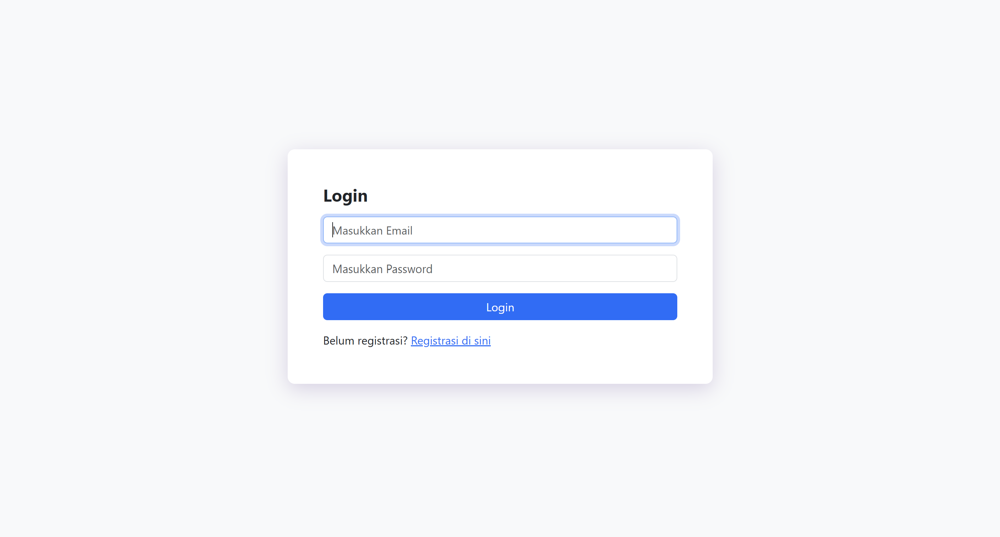

# 🔐 ArgonAuth — Sistem Login & Registrasi Aman

> **Proyek Keamanan Sistem** | Telkom University — Tingkat 3 (2026)


---

## 📌 Deskripsi Proyek

**ArgonAuth** adalah aplikasi web autentikasi (login & registrasi) berbasis PHP dan MySQL yang dirancang dengan menerapkan berbagai teknik **mitigasi keamanan** sesuai standar modern, antara lain:

| Ancaman | Mitigasi yang Diterapkan |
|---|---|
| **SQL Injection** | Prepared Statement (`mysqli_stmt`) |
| **XSS (Cross-Site Scripting)** | `htmlspecialchars()` pada semua input |
| **Password Plaintext** | Hashing dengan **Argon2ID** (`password_hash`) |
| **Session Hijacking** | Session management dengan `session_start()` |

---

## 🗂️ Struktur Direktori

```
login-register2/
├── assets/
│   ├── laman.png        # Screenshot halaman utama
│   ├── login2.png       # Screenshot halaman login
│   └── regis2.png       # Screenshot halaman registrasi
├── database.php         # Konfigurasi koneksi database
├── index.php            # Halaman utama (dashboard) — hanya bisa diakses setelah login
├── login.php            # Halaman login
├── logout.php           # Proses logout (hapus session)
├── registrasi.php       # Halaman registrasi pengguna baru
├── style.css            # File CSS tambahan
└── README.md            # Dokumentasi proyek ini
```

---

## ✨ Fitur Utama

- ✅ **Registrasi** pengguna baru dengan validasi lengkap
- ✅ **Login** dengan verifikasi password terenkripsi
- ✅ **Logout** yang membersihkan session
- ✅ Proteksi halaman dashboard (redirect jika belum login)
- ✅ Validasi email format, panjang password (min. 8 karakter), dan konfirmasi password
- ✅ Tampilan responsif menggunakan **Bootstrap 5.3**

---

## ⚙️ Prasyarat (Prerequisites)

Pastikan lingkungan berikut sudah tersedia sebelum menjalankan proyek:

| Software | Versi Minimum | Keterangan |
|---|---|---|
| **XAMPP** | 8.x | Sudah termasuk Apache + PHP + MySQL |
| **PHP** | 8.0+ | Dibutuhkan untuk `PASSWORD_ARGON2ID` |
| **MySQL** / **MariaDB** | 5.7+ | Database server |
| **Web Browser** | Terbaru | Chrome, Firefox, Edge, dll. |
| **Git** | Terbaru | Untuk clone repository |

> ⚠️ **Penting:** `PASSWORD_ARGON2ID` memerlukan PHP versi **7.3 ke atas** dan ekstensi `sodium`. XAMPP versi terbaru sudah mendukung ini secara default.

---

## 🚀 Cara Instalasi & Menjalankan (di XAMPP / VMware)

### Langkah 1 — Install XAMPP

1. Download XAMPP dari [https://www.apachefriends.org](https://www.apachefriends.org)
2. Install dan jalankan **XAMPP Control Panel**
3. Klik **Start** pada modul **Apache** dan **MySQL**

---

### Langkah 2 — Clone Repository

Buka **Terminal** (CMD / PowerShell / Git Bash) lalu jalankan:

```bash
cd C:/xampp/htdocs/
git clone https://github.com/mhabibier/login-register2.git
cd login-register2
```

> 💡 Jika menggunakan **VMware Linux**, sesuaikan path:
> ```bash
> cd /opt/lampp/htdocs/
> git clone https://github.com/mhabibier/login-register2.git
> cd login-register2
> ```

---

### Langkah 3 — Buat Database

1. Buka browser dan akses **phpMyAdmin**: [http://localhost/phpmyadmin](http://localhost/phpmyadmin)
2. Klik **"New"** → beri nama database: `login-register`
3. Pilih database `login-register`, lalu klik tab **SQL**
4. Jalankan query berikut:

```sql
CREATE DATABASE IF NOT EXISTS `login-register`;
USE `login-register`;

CREATE TABLE `users` (
  `id`        INT(11) NOT NULL AUTO_INCREMENT,
  `full_name` VARCHAR(100) NOT NULL,
  `email`     VARCHAR(120) NOT NULL UNIQUE,
  `password`  VARCHAR(255) NOT NULL,
  `created_at` TIMESTAMP DEFAULT CURRENT_TIMESTAMP,
  PRIMARY KEY (`id`)
) ENGINE=InnoDB DEFAULT CHARSET=utf8mb4;
```

---

### Langkah 4 — Konfigurasi Database

Buka file `database.php` dan sesuaikan dengan konfigurasi lokal kamu:

```php
<?php
$hostName   = "localhost";   // Host database
$dbUser     = "root";        // Username MySQL (default XAMPP: root)
$dbPassword = "";            // Password MySQL (default XAMPP: kosong)
$dbName     = "login-register"; // Nama database yang sudah dibuat

$conn = mysqli_connect($hostName, $dbUser, $dbPassword, $dbName);
if (!$conn) {
    die("Koneksi database gagal: " . mysqli_connect_error());
}
?>
```

> ⚠️ Jika kamu menggunakan password MySQL yang berbeda (misalnya di VM), sesuaikan `$dbPassword`.

---

### Langkah 5 — Akses Aplikasi

Buka browser dan akses:

```
http://localhost/login-register2/login.php
```

Atau untuk registrasi akun baru:
```
http://localhost/login-register2/registrasi.php
```

---

## 🖥️ Screenshot

### Halaman Login


### Halaman Registrasi


### Halaman Dashboard


---

## 🔒 Penjelasan Keamanan

### 1. SQL Injection Prevention — Prepared Statement
```php
$sql = "SELECT * FROM users WHERE email = ?";
$stmt = mysqli_stmt_init($conn);
mysqli_stmt_prepare($stmt, $sql);
mysqli_stmt_bind_param($stmt, "s", $email);
mysqli_stmt_execute($stmt);
```
Parameter query dipisahkan dari data pengguna sehingga query tidak bisa dimanipulasi.

### 2. XSS Prevention — htmlspecialchars()
```php
$email = htmlspecialchars($_POST["email"], ENT_QUOTES, 'UTF-8');
```
Karakter berbahaya seperti `<`, `>`, `"` dikonversi menjadi entitas HTML yang aman.

### 3. Password Hashing — Argon2ID
```php
$passwordHash = password_hash($password, PASSWORD_ARGON2ID);
// Verifikasi:
password_verify($password, $user["password"])
```
Argon2ID adalah algoritma hashing modern yang tahan terhadap serangan brute-force dan side-channel attack.

---

## 🛠️ Teknologi yang Digunakan

- **PHP 8** — Backend scripting
- **MySQL** — Penyimpanan data pengguna
- **Bootstrap 5.3** — Framework CSS responsif
- **Font Awesome 6** — Icon library
- **Apache (XAMPP)** — Web server lokal

---

## 👨‍💻 Author

| Nama | NIM | Institusi |
|---|---|---|
| Muhammad Habibie R | - | Telkom University |

> **Mata Kuliah:** Keamanan Sistem | **Tahun:** 2026

---

## 📄 Lisensi

Proyek ini dibuat untuk keperluan akademis. Dilarang menggunakan untuk tujuan komersial tanpa izin.
